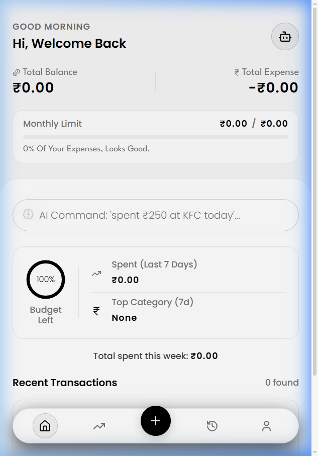
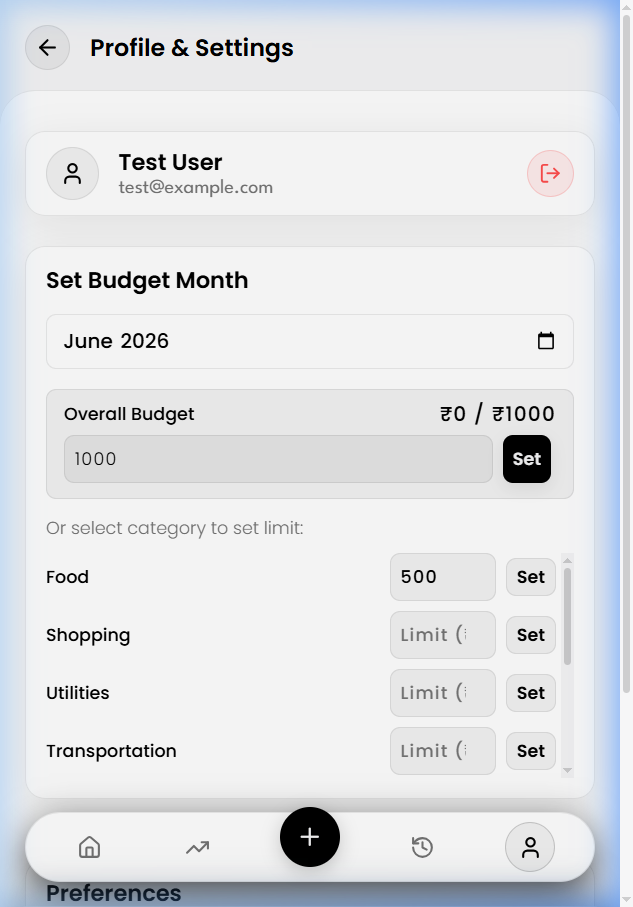
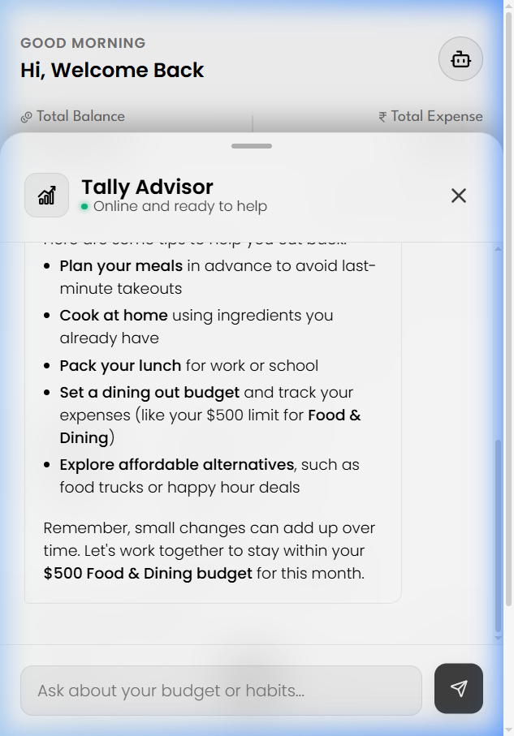

# AI Expense Tracker (Tally)

An intelligent, full-stack personal finance assistant that empowers users to track their spending, manage category budgets, and gain deep insights through artificial intelligence.

The application features a responsive client interface (optimized for both desktop and mobile screens) and an Express-powered backend utilizing SQLite with Drizzle ORM and Groq's Vision & Language AI models.

---

## 🚀 Key Features

*   **Secure Authentication**: JWT-based user registration and login system with password hashing powered by `bcryptjs`.
*   **Vision-Powered Receipt Scanner**: Upload or drag-and-drop receipt images to automatically extract transaction details (merchant, amount, category, date, and description) using Groq's Vision LLM (`llama-3.2-11b-vision-preview`).
*   **Natural Language Quick-Logging**: Type a simple note (e.g., *"spent $14.50 on a coffee and muffin at Starbucks yesterday"*) and let the AI automatically structure and parse it.
*   **Personalized AI Financial Advisor ("Tally")**: A context-aware chatbot that reviews your monthly budgets and transaction history to answer queries (e.g., *"How much did I spend on dining out this month?"*, *"Am I staying within my budget limits?"*) and suggest personalized money-saving advice.
*   **Budget Management**: Set and update monthly category limits, with real-time remaining budget calculations.
*   **Beautiful Financial Analytics**: Clean visual distribution charts (category donut charts) and historical spending curves (trend line charts) using native SVG graphs.
*   **Dual-Layout Design**: A premium dark-mode responsive glassmorphic UI, with dedicated structures for desktop dashboard navigation and a bottom-bar mobile app layout.

---

## 📸 App Screenshots

Here are some screenshots showcasing the premium dark-mode dashboard interface, category budget configuration, and our AI financial advisor chat window:

### 1. Main Dashboard


### 2. Category Budget Configuration


### 3. Tally - AI Financial Chatbot Advisor


---

## 🛠️ Technology Stack

### Frontend
*   **Framework**: [React 19](https://react.dev/) + [Vite](https://vite.dev/)
*   **Styling**: Custom modern Vanilla CSS with custom HSL CSS variables, smooth animations, glassmorphism, and transitions.
*   **Icons**: [Lucide React](https://lucide.dev/)
*   **Linter**: [Oxlint](https://oxc.rs/docs/guide/usage/linter/introduction.html)

### Backend
*   **Runtime**: [Node.js (ES Modules)](https://nodejs.org/)
*   **Framework**: [Express](https://expressjs.com/)
*   **Database ORM**: [Drizzle ORM](https://orm.drizzle.team/)
*   **Database Engine**: SQLite / LibSQL client (local `local.db` file or Cloud Turso database connection)
*   **AI Integration**: [Groq Cloud API Developer Platform](https://consolegroq.com/) (using Llama 3.2 Vision & Llama 3.3 Versatile models)

---

## 📂 Directory Structure

```text
AIExpenseTracker/
├── backend/
│   ├── src/
│   │   ├── db/          # Database configuration and Drizzle schema definitions
│   │   ├── middleware/  # JWT validation middleware
│   │   ├── routes/      # REST API endpoints (auth, expenses, budgets, chatbot)
│   │   ├── services/    # Groq AI vision, quick-log, and chatbot service layer
│   │   └── server.js    # Express app startup and configuration
│   ├── drizzle/         # Generated Drizzle SQL migration files
│   ├── .env.example     # Template for environment variables
│   ├── drizzle.config.js# Drizzle kit configuration file
│   └── package.json
│
├── frontend/
│   ├── public/          # Static assets & icons
│   ├── src/
│   │   ├── assets/      # Vite/React logos
│   │   ├── components/  # Page-level components, tables, and charts
│   │   │   └── Dashboard/ # Desktop layouts and mobile-specific components
│   │   ├── context/     # React state providers (AuthContext)
│   │   ├── App.jsx      # Main router and shell layout
│   │   ├── main.jsx     # Root mount point
│   │   ├── App.css      # Core application style definitions
│   │   └── index.css    # Typography, HSL color variables, and global resetting
│   ├── .oxlintrc.json   # Oxlint static analysis config
│   ├── vite.config.js   # Vite bundle config
│   └── package.json
│
└── README.md            # You are here!
```

---

## ⚙️ Installation & Setup

### Prerequisites
*   [Node.js](https://nodejs.org/) (v18.0.0 or higher recommended)
*   npm (installed with Node.js)

### 1. Set Up the Backend

1.  Navigate into the `backend` directory:
    ```bash
    cd backend
    ```
2.  Install dependencies:
    ```bash
    npm install
    ```
3.  Configure your environment variables. Copy the example file:
    ```bash
    cp .env.example .env
    ```
4.  Open `.env` and fill in the values:
    *   `PORT`: The port on which the server should listen (default: `5000`).
    *   `JWT_SECRET`: A secure random string for signing login sessions.
    *   `GROQ_API_KEY`: Your Groq API key from the [Groq Console](https://console.groq.com/).
        > [!NOTE]
        > If you leave `GROQ_API_KEY` blank, the application will run in **mock mode**. Receipt scanning, quick logging, and chatbot financial advice will return realistic mock data for local debugging.
    *   `DATABASE_URL` / `DATABASE_AUTH_TOKEN`: (Optional) Leave blank to use a local development file (`local.db`), or specify a Turso URL for cloud SQLite sync.

5.  Initialize your database and push the schema using Drizzle Kit:
    ```bash
    npm run db:push
    ```
6.  Start the development server:
    ```bash
    npm run dev
    ```
    The backend server will run on `http://localhost:5000` (or your custom PORT).

---

### 2. Set Up the Frontend

1.  Open a new terminal session and navigate to the `frontend` directory:
    ```bash
    cd frontend
    ```
2.  Install client-side dependencies:
    ```bash
    npm install
    ```
3.  (Optional) Create a `.env` file in the frontend folder if you want to connect to a different backend server:
    ```env
    VITE_API_URL=http://localhost:5000/api
    ```
    *(By default, it will fall back to `http://localhost:5000/api` if no environment variable is set).*
4.  Start the Vite local development server:
    ```bash
    npm run dev
    ```
5.  Open your browser and navigate to the URL shown in the terminal (typically `http://localhost:5173`).

---

## 🗄️ Database Management (Drizzle)

You can manage the SQLite schema using these commands from within the `backend/` directory:

*   **Push Schema Changes**: Sync your `src/db/schema.js` modifications directly to the database file without running a full migration pipeline:
    ```bash
    npm run db:push
    ```
*   **Generate Migration files**: Write schema history changes into SQL statements:
    ```bash
    npm run db:generate
    ```
*   **Drizzle Studio**: Start a visual database explorer locally:
    ```bash
    npm run db:studio
    ```

---

## 📡 API Endpoints Reference

### Authentication (`/api/auth`)
*   `POST /api/auth/register`: Create a new user account. Required body: `{ email, password, name }`. Returns user profile and JWT.
*   `POST /api/auth/login`: Authenticate an existing user. Required body: `{ email, password }`. Returns user profile and JWT.
*   `GET /api/auth/me`: Get profile info for the currently authenticated user based on the authorization header.

### Expenses (`/api/expenses`)
*   `GET /api/expenses`: Retrieve all logged expenses for the authenticated user (sorted by date desc).
*   `POST /api/expenses`: Log an expense manually. Required body: `{ amount, category, description, date }`.
*   `DELETE /api/expenses/:id`: Delete an expense by ID (only if owned by the logged-in user).
*   `POST /api/expenses/quick-log`: Parse a natural language text command to structure an expense transaction. Required body: `{ text }`.
*   `POST /api/expenses/scan`: Upload a receipt image file (field name: `receipt`, max 5MB) to extract details.

### Budgets (`/api/budgets`)
*   `GET /api/budgets`: Fetch all category budget limits for a given month. Accepts optional query parameter `?month=YYYY-MM`.
*   `POST /api/budgets`: Create or update a budget limit. Required body: `{ category, limitAmount, month }`.

### Chatbot (`/api/chatbot`)
*   `POST /api/chatbot`: Conversation loop with the AI financial assistant. Sends the current message and chat history. The router injects the user's spending data and budget limits as context to supply personalized financial advice. Required body: `{ message, history }`.

---

## 💡 Environment Checklist

*   Ensure you have created the `.env` file inside `backend/`.
*   Make sure `JWT_SECRET` is not set to default values in production.
*   To enable real-time image OCR scanning and conversational budgeting, make sure to set `GROQ_API_KEY`.
